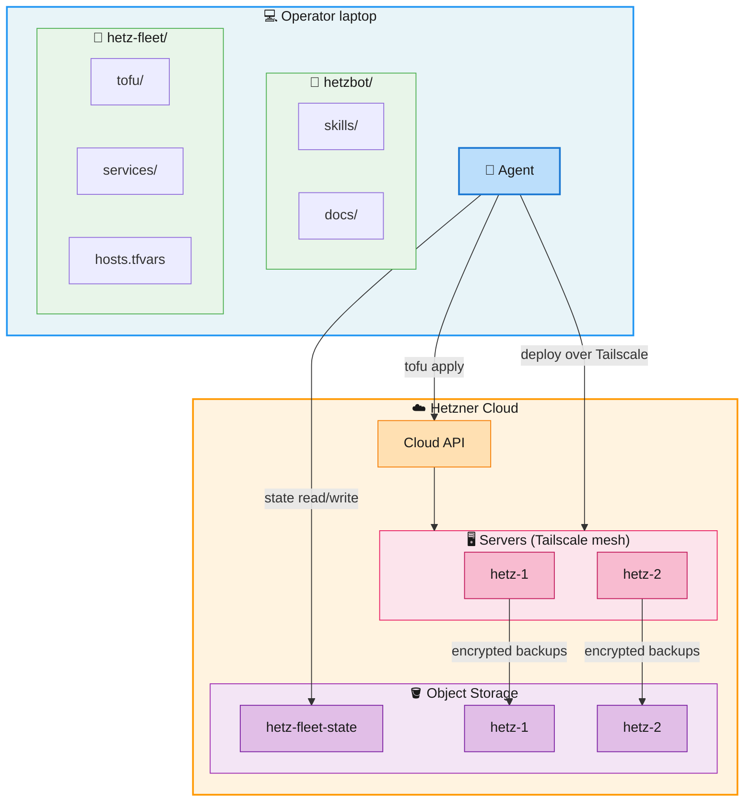

Agent-managed hosting on Hetzner Cloud. Provision servers, deploy
services, back up data, review security — all driven by a coding
agent following documented skill playbooks.

## Concept

Two repos sit side by side: **hetzbot** (the framework — skills,
templates, docs) and your **fleet repo** (servers, services, secrets).
A coding agent reads the skill playbooks and operates the fleet for
you — one question at a time. Infrastructure is OpenTofu, access is
Tailscale-only, backups are encrypted to S3. No SSH keys, no port 80,
no manual config.

## How it works



**Fleet setup:** One fleet repo defines your servers (`hosts.tfvars`)
and services. OpenTofu provisions hosts via the Hetzner API; cloud-init
bootstraps each server with Tailscale, firewall, and unattended
upgrades. State lives in S3 (Object Storage). Each host gets its own
S3 bucket for encrypted restic backups.

**No public SSH.** Operator access is Tailscale-only. Headless hosts
expose nothing to the internet; public hosts expose only port 443
(Caddy + ACME).

## Shared infrastructure

Installed on-demand per host by skills:

| Skill | What | Runs as |
|---|---|---|
| **Postgres** | Shared Postgres 16 instance. Per-service DB + role auto-provisioned. Passwords generated, rotated, backed up. | Docker Compose, 127.0.0.1 only |
| **Google API** | OAuth2 credentials for Gmail, Drive, Sheets. One credential set per fleet, deployed to hosts. | Token files at `/etc/hetzbot/google/` |
| **Caddy** | Reverse proxy + auto-TLS (public hosts only). Per-service config snippets assembled at deploy. | Systemd, port 443 |
| **Docker** | Container runtime for stateful infra (Postgres). Hardened `daemon.json`. | Systemd |
| **Restic** | Encrypted backups to S3. Daily timer + per-skill hooks (pg_dump). | Systemd timer |

## Custom services

Your services are GitHub repos deployed as systemd units. The agent
walks you through setup:

```
> "Add the myapi service from github.com/org/myapi to hetz-1"
```

The `add-service` skill:
1. Asks for name, repo URL, target host, shape (long-running or scheduled).
2. Scaffolds `services/<name>/` — systemd unit, timer (if scheduled), env template.
3. Auto-detects runtime (Node/Python) from lockfile, installs if needed.
4. Provisions Postgres DB + role if the service needs one.
5. Deploys: git clone, build, install unit + hardening drop-in, start.
6. Runs backup + verification.

```
fleet-repo/
  services/
    myapi/
      source              # git@github.com:org/myapi.git
      myapi.service       # systemd unit
      myapi.timer         # (optional) schedule
      caddy.conf          # (optional) HTTPS reverse proxy
      provision.sh        # (optional) custom provisioning
```

Services bind `127.0.0.1` only, get a systemd hardening drop-in
automatically, and require a lockfile to deploy.

## Backups

Every host runs a nightly backup timer:
1. Per-skill hooks run first (Postgres: `pg_dump` per database).
2. Restic encrypts and pushes `/srv`, `/etc`, `/var/backups`, Docker
   volumes to the host's own S3 bucket.
3. Retention: 7 daily, 4 weekly, 12 monthly snapshots.

Restore a single service or rebuild a full host from tofu + restic.

## Quickstart

```bash
git clone https://github.com/tomspiegl/hetzbot
```

Open a coding agent in the repo and paste:

```
Set up a new hetzbot fleet named my-fleet at ~/my-fleet.
Walk me through prerequisites, then scaffold the fleet and add my first host.
```

The agent reads `CLAUDE.md`, follows the skill playbooks, and walks
you through one question at a time.

## Skills

| Group | Skills |
|---|---|
| **hetzner/** | init-fleet, add-host, remove-host, check-fleet, review-host, verify-fleet, snapshot-host |
| **ops/** | add-service, remove-service, deploy, restore, backup, rotate-service |
| **infra/** | docker, restic, caddy, postgres, google |
| **runtimes/** | node, python |

Each skill is a `SKILL.md` playbook + optional scripts (`install.sh`,
`review.sh`, `backup.sh`). Skills are self-contained — the agent reads
one file and executes it step by step.

## Documentation

Full handbook in [`docs/`](docs/).
