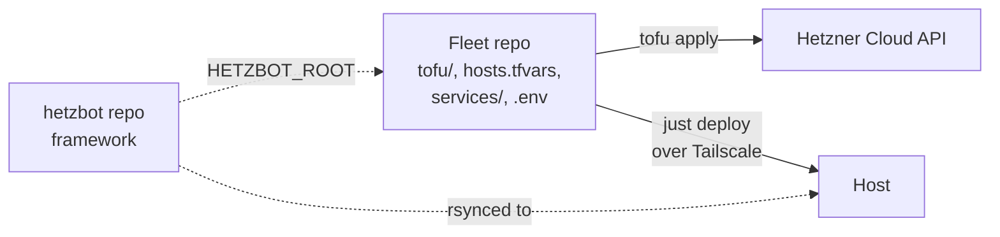
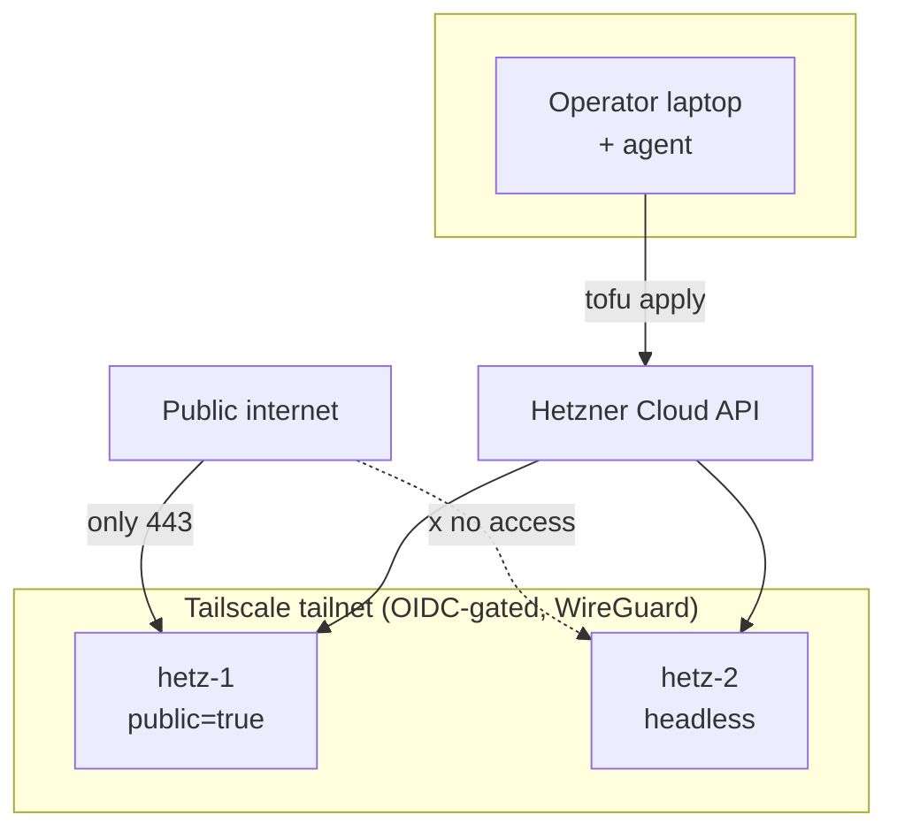
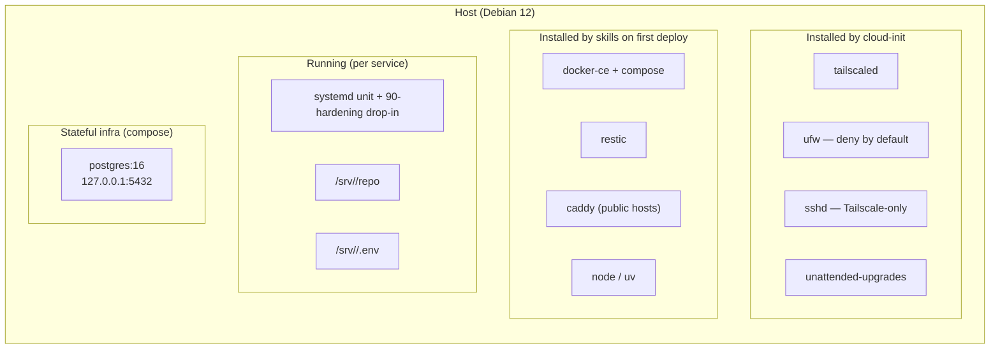
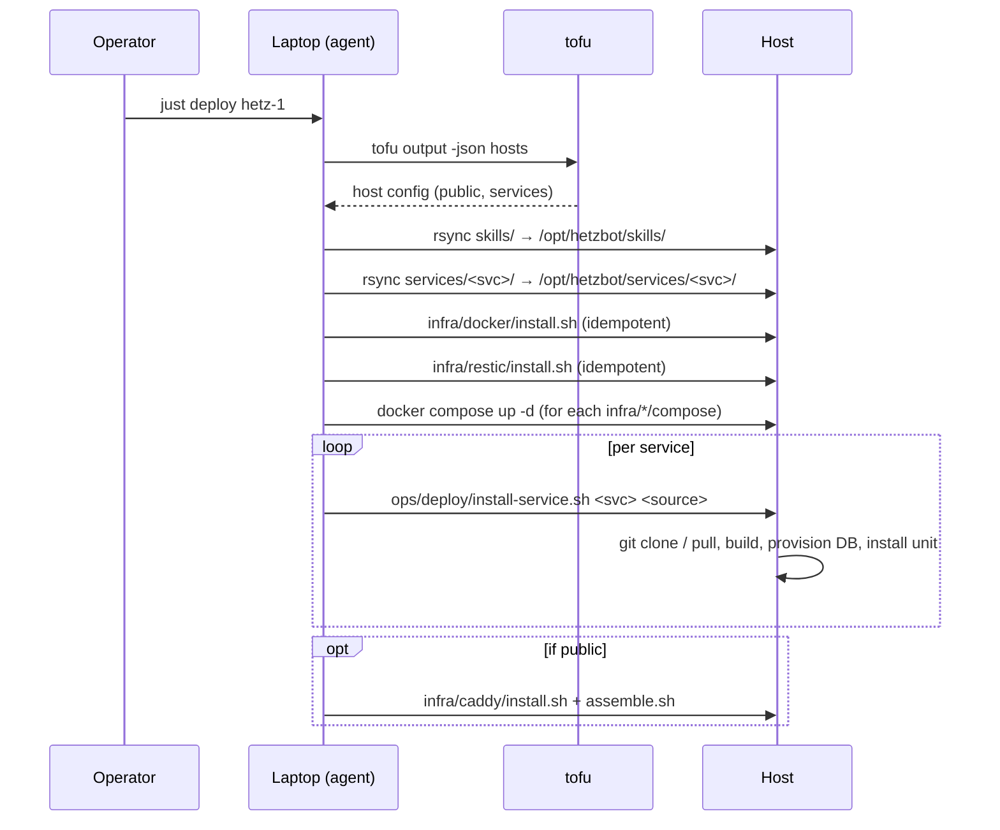
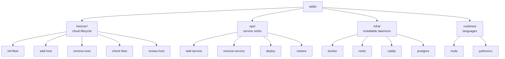

# Architecture

How the pieces fit.

## Two repos



- **Framework (`hetzbot`)** — skills, templates, docs. One clone per
  operator laptop.
- **Fleet** — everything project-specific: tofu config, hosts,
  services, credentials. One repo per fleet.

The fleet points at the framework via `HETZBOT_ROOT=../hetzbot` in its
`.env`. All scripts accept `HETZBOT_FLEET_ROOT` (default `$PWD`) to
locate fleet data at runtime.

## Network topology



Operator never uses a public SSH port. Only `public = true` hosts
expose anything to the internet — and only 443. Port 80 is never
opened anywhere.

## Host runtime

What actually runs on one host after cloud-init + first deploy:



Cloud-init installs only the bootstrap minimum — enough to join the
tailnet and accept rsync. Everything else is a skill, installed at
first deploy.

## Deploy flow



Every step is idempotent. Re-running deploy is safe and cheap.

## Backup flow

```mermaid
graph LR
    T[systemd timer<br/>02:30 daily] --> B[ops/deploy/backup-now.sh]
    B --> Hooks[[Discover and run<br/>each skills/infra/#42;/backup.sh]]
    Hooks --> PGBackup[postgres/backup.sh<br/>pg_dump -Fc per DB]
    PGBackup --> D[/var/backups/pg/*.dump]
    B --> R[restic backup]
    D --> R
    SRV[/srv /var/lib/docker /etc .../] --> R
    R --> OS[Hetzner Object Storage<br/>encrypted at rest]
```

Each stateful skill ships its own `backup.sh`. `backup-now.sh` is a
thin orchestrator — it runs every hook, then does one restic pass over
the well-known paths.

## Skill composition



- **hetzner/** — agent playbooks for managing Hetzner Cloud resources
  (VMs, firewall, DNS).
- **ops/** — service lifecycle. These are cross-cutting; they invoke
  infra/ and runtimes/ skills as needed.
- **infra/** — third-party daemons. Each is self-contained; has its
  own `install.sh`, `review.sh`, optionally `backup.sh` and
  `docker-compose.yml`.
- **runtimes/** — language runtimes. Installed on-demand when
  `install-service.sh` detects a lockfile.

See [skills.md](skills.md) for the catalog with usage notes.

## State — what lives where

```mermaid
graph TB
    subgraph FS["File system layers"]
        TF[tofu state<br/>Object Storage, encrypted]
        RES[restic repo<br/>Object Storage, encrypted]
        ENV[.env + personal vault<br/>operator laptop only]
    end
    subgraph Source["Source of truth"]
        GIT[Fleet git repo<br/>hosts.tfvars, services/]
        FRAMEWORK[hetzbot git repo<br/>skills/]
        SERVICES[Service GitHub repos<br/>code]
    end
    GIT --> TF
    FRAMEWORK -. rsynced to .-> HOST[/opt/hetzbot/skills/]
    SERVICES -. cloned to .-> HOSTSVC[/srv/&lt;svc&gt;/repo]
    HOST --> RES
    HOSTSVC --> RES
```

- **Infra state** — tofu state file in Object Storage.
- **Data state** — restic snapshots in Object Storage.
- **Config state** — committed in the fleet repo.
- **Session creds** — local `.env`, populated from your personal vault per
  session, cleared after.

Rebuild-from-zero sequence: `tofu apply` → cloud-init → `just deploy` →
`restic restore`.
