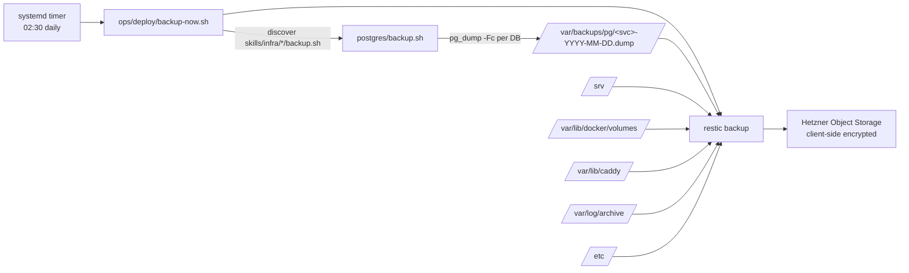

# Backups & Recovery

One tool: **restic**, encrypted, off-host, from day one.

## The flow



- **`backup-now.sh`** is a thin orchestrator. It discovers every
  `skills/infra/*/backup.sh`, runs them, then does one restic pass.
- **Per-DB `pg_dump -Fc`** — custom format, compressed, restorable
  individually via `pg_restore`. Not `pg_dumpall`.
- **restic encrypts client-side** before upload. Your Object Storage
  provider never sees plaintext.

## What's backed up

| Path | Why |
|---|---|
| `/srv/` | Per-service `.env`, code checkouts, build artifacts, any app data written here |
| `/var/lib/docker/volumes/` | Postgres data (and future compose volumes) |
| `/var/lib/caddy/` | Issued certs — survive rebuild without hitting ACME rate limits |
| `/var/backups/pg/` | The per-DB dumps from this cycle |
| `/var/log/archive/` | Frozen daily journal snapshots |
| `/etc/` | Host config (cloud-init-written files; hardening drop-ins) |

Service code in `/srv/<svc>/repo/` is fully reconstructible from
GitHub, but backing it up speeds restores and avoids re-running
`build.sh`.

## Retention

```
restic forget --prune \
  --keep-daily   7 \
  --keep-weekly  4 \
  --keep-monthly 12
```

On-host `pg_dump` files older than 14 days are pruned (restic owns the
long tail).

## Recovery — single service

You want to restore one service's data without touching others.

```bash
just restore   # (runs the restore skill)
# Agent asks: HOST_NAME, SERVICE_NAME, SNAPSHOT (default latest)
```

The skill:
1. Backs up current `/srv/<svc>/` and DB to `*.pre-restore-<ts>` (safety).
2. Stops the systemd unit.
3. `restic restore` for `/srv/<svc>` + the relevant `*.dump` file.
4. `DROP DATABASE ... WITH (FORCE)`; recreate; `pg_restore`.
5. Restarts unit + runs `just review`.

If something went wrong, the pre-restore copies are your rollback.

## Recovery — full host

"rebuild from tofu + systemd + restic." Sequence:

1. `tofu apply` (recreates the VM via Hetzner API, runs cloud-init).
2. Wait for Tailscale join (~60s).
3. `just deploy <host>` (installs docker, restic, caddy as needed;
   brings up infra; re-clones service repos).
4. On the new host, `restic restore latest --target /` for `/srv/`,
   `/var/lib/docker/volumes/`, `/var/lib/caddy/`, `/var/backups/pg/`,
   `/etc/`.
5. Restart services. Run `just review`.

**Target recovery time: under one hour cold.** No hot standby, no
failover — see [non-goals](non-goals.md#high-availability).

## Recovery — the whole fleet

Same as a host, per host. Framework + tofu state + restic repo is all
you need. Fleet repo is in git; tofu state + restic are in Object
Storage.

## Drill

> A backup you haven't restored from is a hope, not a backup.

Run a restore drill periodically:

1. Pick a test service, `just restore` to yesterday's snapshot on a
   scratch CX22.
2. Diff the restored DB against a known baseline.
3. Delete the scratch host.

Putting this on a monthly calendar is the difference between "we have
backups" and "we can recover."

## Hetzner snapshots (second tier)

restic handles **data recovery** (restore individual services or a
host's state to a new VM). It complements but doesn't replace
**whole-disk rollback**, which Hetzner provides two ways:

### Automatic Backups

Per-host toggle in `hosts.tfvars`:

```hcl
hetz-1 = {
  ...
  backups = true   # default
}
```

Hetzner runs a weekly snapshot, keeps 7 days' worth, costs +20% of
the server price. Set `backups = false` per-host for throwaway or
stateless hosts. Default is `true`.

### Manual snapshots

Take one on demand before a risky operation — run the `snapshot-host`
skill: `bash $HETZBOT_ROOT/skills/hetzner/snapshot-host/snapshot.sh
<host>`. Snapshots persist until deleted and are priced per GB-month.
Use them for pre-upgrade rollbacks; clean them up afterward.

### Which tier for which failure

| Failure | Recovery tier |
|---|---|
| Service DB corruption, bad migration | restic → restore skill |
| One service's code gone bad | redeploy from GitHub pinned SHA |
| Host OS corruption (package break, config mistake) | Hetzner snapshot → rebuild |
| Total host loss (bit rot, account issue) | tofu apply + cloud-init + restic restore |
| Hetzner account compromised / region outage | off-provider restic repo (if you mirror) |

Snapshots are **Hetzner-internal** — if the Hetzner account itself is
compromised, snapshots go with it. That's why restic (off-provider,
client-side encrypted) is the ultimate tier.

## What the agent cannot help with

- **Lost `RESTIC_PASSWORD`** — client-side encrypted. If this is gone,
  your backups are unrecoverable. Keep it in your personal vault and keep that
  vault backed up.
- **Deleted Object Storage bucket** — if someone nuked the bucket from
  outside hetzbot, restic can't help. Keep the Hetzner account secure.

See [security.md § Secrets](security.md#secrets).
