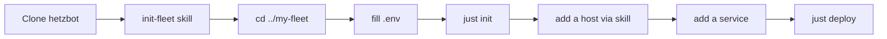

# Quickstart

Zero to a first running service. Assumes nothing.

## Prerequisites (one-time, operator)

The agent **cannot** do these for you. Each involves billing, identity,
or a browser.

| # | What | Where |
|---|---|---|
| 1 | Hetzner Cloud account + project | https://console.hetzner.cloud — create an API token with read+write scope |
| 2 | Hetzner Object Storage bucket | same console — one per fleet; holds both tfstate and restic. Generate S3 access keys |
| 3 | Hetzner DNS zone | https://dns.hetzner.com — only if you'll serve HTTPS. Point registrar NS records at Hetzner |
| 4 | Tailscale tailnet | https://login.tailscale.com — sign in with your work identity via OIDC |
| 5 | your personal vault (e.g. 1Password, Bitwarden, macOS Keychain) | four items: `hcloud-token`, `object-storage`, `restic-password`, `console-root-password` |
| 6 | GitHub org / access to service repos | the host clones over HTTPS |

## Local tooling

```bash
brew install opentofu tailscale just git openssl jq
tailscale up                           # sign in
tofu version && just --version && tailscale status
```

Plus Claude Code for the agent.

## Bootstrap



Step by step:

```bash
# 1. Clone the framework
cd ~/Develop
git clone https://github.com/tomspiegl/hetzbot
cd hetzbot

# 2. Scaffold a fleet repo beside it
bash skills/hetzner/init-fleet/init-fleet.sh ../my-fleet my-fleet
cd ../my-fleet

# 3. Populate .env from your personal vault
cp .env.example .env
#    Fill in HETZBOT_ROOT, HCLOUD_TOKEN, AWS_ACCESS_KEY_ID,
#    AWS_SECRET_ACCESS_KEY, OS_ENDPOINT, OS_BUCKET, OS_REGION,
#    RESTIC_PASSWORD, CONSOLE_ROOT_PASSWORD, DOMAIN (if public).

# 4. Initialize the tofu backend (one-time)
just init

# 5. Open Claude Code from here. Ask it to "add a host."
claude
#    The agent follows skills/hetzner/add-host — asks for name,
#    location, type, public?; edits hosts.tfvars; runs just apply;
#    waits for Tailscale join; runs just review.

# 6. Add a service (agent follows skills/ops/add-service)
#    Asks for service name, GitHub URL, target host, shape,
#    HTTPS-facing?; scaffolds services/<name>/; runs just deploy.
```

When the agent says "Host online," you can verify out of band:

```bash
tailscale status | grep <hostname>
ssh <hostname> uptime          # MagicDNS, via Tailscale SSH
just review <hostname>
```

## What the agent cannot do for you

- Create the Hetzner account, project, or bucket.
- Register a domain.
- Create or unlock the personal vault.
- Sign into Tailscale with your personal identity.
- Merge Renovate / Dependabot PRs in service repos.
- Use the Hetzner web console (VNC) as emergency fallback.

Everything else — edits, `tofu apply`, `just deploy`, `just review`,
rotating secrets, backups, restores — is agent-driven.

## First-day sanity checks

After the first service is deployed:

```bash
just review <host>                              # full audit
just logs <host> <service>                      # tail live
ssh <host> sudo /opt/hetzbot/skills/ops/deploy/backup-now.sh
ssh <host> sudo restic snapshots                # confirm encrypted repo
```

## Going public (optional)

Flip a host to `public = true` in `hosts.tfvars`, add `caddy.conf` to
the service, `just apply` (opens 443, creates DNS record), `just
deploy <host>` (installs Caddy, issues the cert). Invoke the agent;
it'll walk the steps.

See [security.md](security.md) for why port 80 stays closed and how
TLS-ALPN-01 works.
