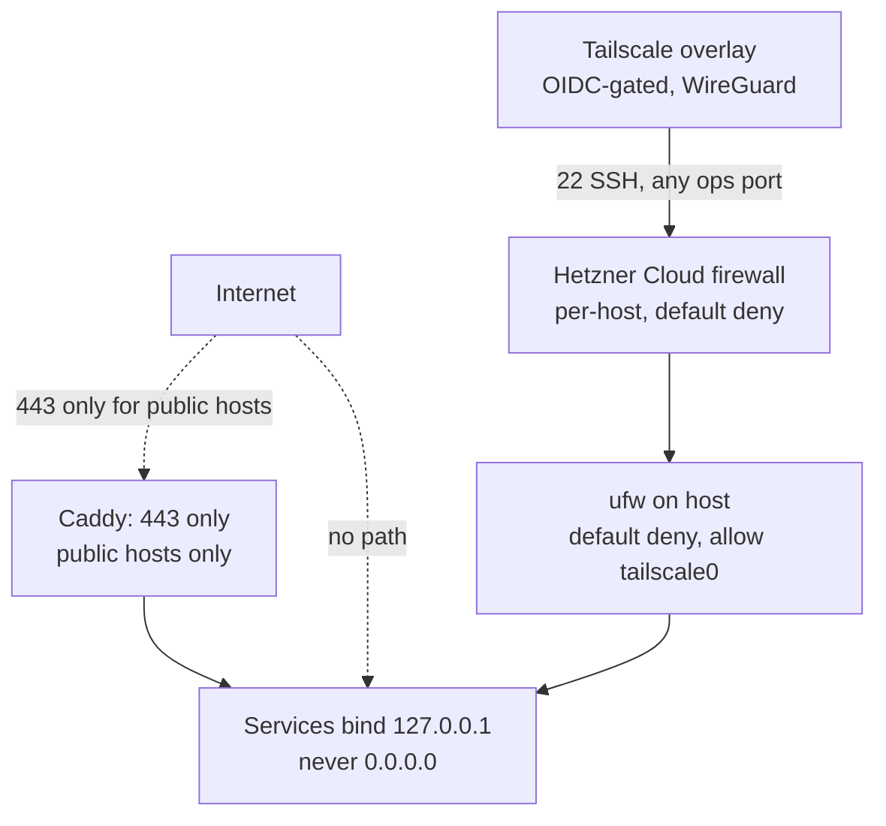

# Security

The goal: a small, patched, alerted surface. Not defense-in-depth
fortress.

## Layers

**Four rings, each default-deny:**

1. **Hetzner Cloud firewall** — at the hypervisor edge. Headless:
   nothing in. Public: 443 in. No SSH, no port 80, no anything else.
2. **Host ufw** — `default deny incoming`, `allow in on tailscale0`,
   conditional `allow 443/tcp` on public hosts.
3. **sshd hardening** — `PasswordAuthentication no`, `PermitRootLogin
   no`, `ListenAddress tailscale0` only. No public SSH.
4. **Service binds** — every service binds `127.0.0.1`, never
   `0.0.0.0`. Even with misconfigured firewall, public surface stays
   tiny.

## Closed by default

A fresh host exposes **nothing** to the internet. `public = true` in
`hosts.tfvars` opts in to HTTPS:

- Creates a DNS A/AAAA record.
- Opens Hetzner firewall 443.
- Installs Caddy (`skills/infra/caddy/install.sh`).

Port 80 is **never** opened. ACME uses TLS-ALPN-01 on 443 itself — no
plaintext listener. HTTP is not an access path at all.

## Operator access

- **Tailscale SSH.** Tailnet identity (OIDC) is the credential. No SSH
  keys on hosts. No `authorized_keys` to rotate. Each operator has
  their own identity; offboarding is one click.
- **No shared accounts.** Each operator signs into Tailscale with
  their own work email.
- **Emergency fallback:** Hetzner web console (VNC) login with
  `CONSOLE_ROOT_PASSWORD` from your personal vault. SSH won't accept it (that's
  disabled); only the VNC console path does.

See [concepts](concepts.md) for the agent's access model — it
inherits your Tailscale identity; no separate credential.

## Secrets

**Two tiers, cleanly separated.**

**Operator credentials — personal vault.** Four items, long-lived:

| Item | Used for |
|---|---|
| `hcloud-token` | tofu apply (Hetzner API) |
| `object-storage` | S3 access key + secret (tfstate backend + restic repo) |
| `restic-password` | backup encryption |
| `console-root-password` | Hetzner VNC console fallback |

Plus ephemeral per-host: Tailscale pre-auth keys (single-use, 1h).

These populate the operator's local `.env` at session start. The agent
reads `.env` — never the vault directly.

**Service credentials — host-generated.** DB passwords, future S3
keys, OIDC client secrets. Generated once on first provision, stored
at `/srv/<svc>/.env` (mode 0640, `root:<svc>`). Backed up by restic.
Operators never generate, copy, or paste them in the steady state.

- `skills/infra/postgres/install.sh` writes the `.env`.
- `skills/infra/postgres/rotate.sh <svc>` regenerates + restarts.

## Safe defaults

Every service gets these **automatically** — opting *out* requires an
explicit override commit.

- **systemd hardening drop-in** at
  `/etc/systemd/system/<svc>.service.d/90-hardening.conf` —
  `NoNewPrivileges`, `PrivateTmp`, `ProtectSystem=strict`,
  `ReadWritePaths=/srv/<svc>`, and a dozen more. Written by
  `ops/deploy/install-service.sh`; the service author's unit file is
  never touched.
- **Lockfile required** at deploy time. `install-service.sh` refuses
  to build without `package-lock.json` / `uv.lock` / `go.sum` /
  `Cargo.lock`.
- **`/etc/npmrc` lockdown** (written by the node skill's install.sh):
  `ignore-scripts=true`, `audit-level=high`, `fund=false`. Kills
  postinstall as an attack vector host-wide.
- **uv `sync --locked`** as the default Python build — hashes
  verified against the lockfile.
- **Caddy security headers** shipped in the global block (HSTS, no
  server header, X-Content-Type-Options).
- **Signed-by apt repos.** Every third-party repo (Docker, NodeSource,
  Caddy, Tailscale) uses a keyring under `/etc/apt/keyrings/`. Never
  `apt-key add`.
- **Postgres container** runs as non-root UID with
  `no-new-privileges`, binds `127.0.0.1` only.

## Patching

- **`unattended-upgrades`** — nightly security patches.
- **`Automatic-Reboot-Time 04:00`** — reboots nightly if a kernel or
  glibc patch requires it.
- **`needrestart`** — auto-restarts services whose libs were patched.
- **`debsecan`** — weekly scan for High/Critical CVEs.
- **Each third-party repo** (NodeSource, Docker, Caddy) is added to
  the unattended-upgrades allowlist by its skill's install.sh.

The review-host skill reports if any of these silently fail.

## Supply chain

Scanning lives in **each service repo's CI**, not on the host. Every
service repo runs `npm audit --audit-level=high` / `pip-audit` /
`cargo audit` as a PR gate, with Dependabot or Renovate opening bump
PRs. Deploy refuses services without a lockfile, so the lockfile's
integrity hashes are always verified at install time.

The hetzbot repo itself has no upstream code dependencies — it's just
shell, tofu HCL, and SKILL.md files.

## What we deliberately don't run

- **fail2ban** — no public SSH to brute-force.
- **HIDS/IDS** — host is small and declaratively reproducible;
  detection complexity doesn't fit the fleet size.
- **WAF** — app filtering is the service's job.
- **Root-disk encryption** — doesn't protect against hypervisor
  access, the only realistic attacker.
- **SSH key rotation scripts** — no SSH keys to rotate.
