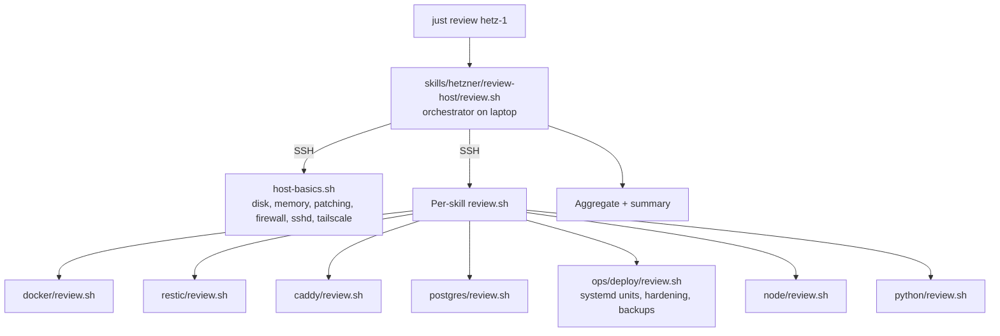

# Skills

Skills are how the agent does things. Each skill is a small directory
with a SKILL.md playbook plus optional scripts. The agent matches your
request to a skill and follows its program.

## Convention

```
skills/<group>/<skill>/
├── SKILL.md          the playbook (always)
├── install.sh        idempotent host-side install (for infra skills)
├── review.sh         read-only audit; emits [SEV] cat: msg lines
├── backup.sh         pre-backup hook for stateful skills
└── <assets>          docker-compose.yml, templates, etc.
```

All `review.sh` scripts source `/opt/hetzbot/skills/ops/deploy/lib.sh`
for the shared `finding` helper. `skills/hetzner/review-host/` is an
orchestrator that SSHes once, runs host-basics.sh + every skill's
review.sh, aggregates results, prints summary.

## Catalog

### `skills/hetzner/` — cloud / server lifecycle

| Skill | Purpose | Triggers |
|---|---|---|
| `init-fleet` | Scaffold a new fleet repo from the template. | "set up a new fleet", "bootstrap a fleet repo" |
| `add-host` | Provision a Hetzner VM. Interactive, program-style. | "add a host", "new server", "provision a box" |
| `remove-host` | Safely destroy a host. Destructive, double-confirmed. | "remove hetz-2", "decommission", "destroy the box" |
| `check-fleet` | Quick pulse on the whole fleet. | "is everything up", "status" |
| `review-host` | Severity-tagged audit of one host (orchestrator). | "review hetz-1", "audit <host>", "is it healthy" |

### `skills/ops/` — service lifecycle (verbs)

| Skill | Purpose | Triggers |
|---|---|---|
| `add-service` | Attach a first-party service to a host. Program-style. | "add a service", "wire up <repo>", "deploy <name>" |
| `remove-service` | Clean removal: stop unit, drop DB, remove `/srv/<svc>`. | "remove <svc>", "tear down <name>" |
| `deploy` | The orchestrator. Rsyncs skills + services to a host, installs needed infra, runs install-service per service. Also houses `backup-now.sh` (systemd timer) and `lib.sh`. | "deploy", "push changes", "roll out" |
| `restore` | Restore a single service from restic + pg_dump. | "restore <svc>", "roll back <svc> data" |

### `skills/infra/` — installable daemons / stacks

| Skill | Purpose | Installs |
|---|---|---|
| `docker` | Docker Engine + Compose plugin. Hardened `daemon.json`. | Before any compose stack |
| `restic` | Backup tool. | First deploy on any host |
| `caddy` | Reverse proxy + ACME. Ships `assemble.sh` that concatenates per-service snippets. | First deploy on a `public = true` host |
| `postgres` | Shared Postgres 16 stack + per-service `install.sh` + `rotate.sh` + `backup.sh`. | First deploy |

### `skills/runtimes/` — language runtimes

| Skill | Purpose | Installs |
|---|---|---|
| `node` | NodeSource LTS + `/etc/npmrc` lockdown. | When `install-service.sh` sees `package-lock.json` |
| `python` | `uv` (Astral). uv manages Python itself. | When a service has `uv.lock` or `pyproject.toml` |

## Program-style skills

Interactive skills (add-host, remove-host, add-service, remove-service,
restore, init-fleet) follow a program template: `ASK` for variables,
`IF`/`WHILE` for control flow, `FAIL` on validation errors, explicit
recovery section at the end. The agent reads the SKILL.md and
executes step by step — you confirm each prompt.

This is deliberate: the agent never invents values for things like a
hostname or service name. If you don't answer, it asks again.

## Reviewer composition



Every skill owns its own review. Adding a new skill means adding its
`review.sh`; the orchestrator picks it up automatically.

## Adding a new skill

Minimum viable skill:

```
skills/<group>/<name>/
└── SKILL.md
```

If it installs something on the host, add `install.sh` (idempotent).
If it has state worth auditing, add `review.sh`. If its state needs
backing up (database, persistent volume), add `backup.sh`.

Follow the program style for interactive skills — makes the agent's
behavior predictable.
